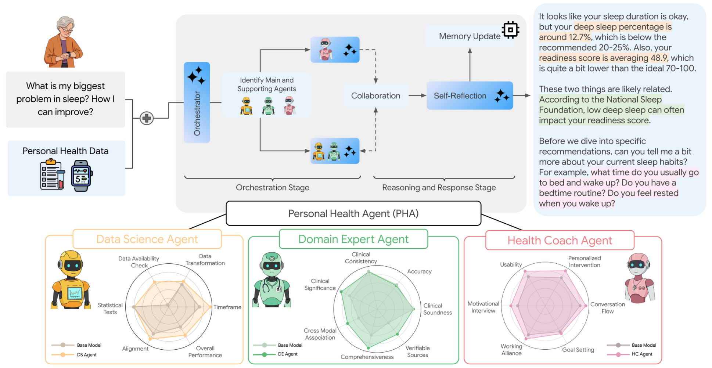

# Personal Health Agent (PHA) Framework

<p align="center">
:fire: Please remember to :star: this repo if you find it useful and <a href="https://github.com/google-health/consumer-health-research/tree/main/personal_health_agent#scroll-citation">cite</a> our work if you end up using it in your work! :fire:
</p>
<p align="center">
:fire: If you have any questions or concerns, please create an issue :memo:! :fire:
</p>

<p align="center">
<a href="https://research.google/blog/the-anatomy-of-a-personal-health-agent/">Blog Post</a> | <a href="https://www.arxiv.org/abs/2508.20148">Pre-print</a>
</p>

The official repository for the paper "The Anatomy of a Personal Health Agent" and its corresponding Personal Health Agent (PHA) framework.



## :sparkles: Overview

PHA is a multi-agent framework for reasoning across multimodal consumer wellness data — wearable sensor streams, activity records, and demographics — to deliver personalized insights and recommendations in everyday, non-clinical settings.

The framework coordinates three specialist sub-agents through an orchestrator:

- **Data Science Agent** — analyzes personal time-series health data, producing trends, comparisons, and on-demand statistics.
- **Domain Expert Agent** — interprets findings against medical reference ranges and broader health context using web search and Data Commons.
- **Health Coach Agent** — synthesizes the above into conversational, actionable guidance.

Two additional architectures are included as baselines for comparison: **Parallel** (the same three specialists with no orchestration) and **PHIA** (a single generalist ReAct agent). The accompanying paper evaluates these designs across 10 benchmark tasks spanning over 7,000 annotations from health experts and end-users.

## :wrench: Setup

Python 3.11+ and conda are required. Run `bash setup.sh` to set up the `pha_framework` conda environment automatically.

```bash
# Full setup (creates conda env and installs all dependencies)
bash setup.sh

# Activate environment
conda activate pha_framework
```

## :rocket: Web Portal (Recommended)

The easiest way to use PHA is through the web portal, which provides a user-friendly interface for configuring and chatting with the health agent.

### Quick Start

```bash
# Terminal 1: Start the API server
conda activate pha_framework
uvicorn api.main:app --reload --port 8000

# Terminal 2: Start the frontend
cd frontend
npm install  # first time only
npm run dev
```

Then open http://localhost:3000 in your browser. The portal will prompt you for API keys.

### Portal Features

- **Provider Selection**: Choose between Gemini and OpenAI models
- **Baseline Comparison**: Compare PHA (orchestrated), Parallel, and PHIA (single-agent) architectures
- **Persona Selection**: Switch between different user health profiles
- **Persistent Settings**: API keys and preferences are saved locally

### System Architectures

| Baseline | Architecture | Description |
|----------|--------------|-------------|
| **PHA** | 3 specialists + orchestrator | Full multi-agent system with intelligent routing |
| **Parallel** | 3 specialists, no routing | All agents run in parallel, responses synthesized |
| **PHIA** | 1 generalist agent | Original single ReAct agent (Gemini and OpenAI) |

## :floppy_disk: Data Format

PHA expects health data in four CSV files. Sample synthetic data is provided in `data/sample/`. See [`data/README.md`](data/README.md) for detailed schema documentation.

| File | Description |
|------|-------------|
| `summary.csv` | Daily health metrics (steps, sleep, heart rate, etc.) |
| `activities.csv` | Individual exercise/activity records |
| `profile.csv` | User demographics (age, gender, height, weight) |
| `population_percentiles.csv` | Population reference data for comparisons |

To use your own data, either:
1. Replace the files in `data/sample/` with your own CSVs following the same schema
2. Create a new persona directory under `data/` with your files
3. Pass custom paths when initializing via `Settings(data_dir="path/to/your/data")`

## :computer: Programmatic Usage

For scripting and notebooks, you can use the agents directly:

```python
import pandas as pd
from pha.agents import (
    DataScienceAgent,
    DomainExpertAgent,
    HealthCoachAgent,
    MultiAgentOrchestrator,
)

# Load your health data
summary_df = pd.read_csv('data/sample/summary.csv')
activities_df = pd.read_csv('data/sample/activities.csv')
profile_df = pd.read_csv('data/sample/profile.csv')
population_df = pd.read_csv('data/sample/population_percentiles.csv')

# Data Science Agent — handles dataframe analysis and statistics
ds_agent = DataScienceAgent()
ds_agent.configure(api_key='your-key', provider='gemini')  # or 'openai'
ds_agent.load_dataframes({
    'summary': summary_df,
    'activities': activities_df,
    'profile': profile_df,
    'population': population_df,
})

# Domain Expert Agent — interprets findings using web search and reference ranges
de_agent = DomainExpertAgent(tavily_api_key='your-tavily-key')
de_agent.get_agent(api_key='your-key', provider='gemini')
health_context = (
    f"## User Profile\n{profile_df.to_string()}\n\n"
    f"## Recent Health Summary\n{summary_df.head(30).to_string()}"
)
de_agent.set_user_health_data(health_context)

# Health Coach Agent — synthesizes guidance in a conversational style
coach = HealthCoachAgent(simple_mode=True)
coach.configure(api_key='your-key', provider='gemini')

# Orchestrator — routes questions across the three specialists
pha = MultiAgentOrchestrator()
pha.configure(api_key='your-key', provider='gemini')
pha.set_agents(
    data_science_agent=ds_agent,
    domain_expert_agent=de_agent,
    health_coach_agent=coach,
)

# Ask questions about your health
response = pha.respond("How has my sleep been lately?")
print(response)
```

### Notebooks

Tutorial notebooks live in [`notebooks/`](notebooks/) and walk through each agent in isolation as well as the full pipeline:

| Notebook | Description |
|----------|-------------|
| `01_quickstart.ipynb` | Get started in 5 minutes |
| `02_data_science_agent.ipynb` | Data analysis and trend detection |
| `03_domain_expert_agent.ipynb` | Medical interpretation with ReAct |
| `04_health_coach_agent.ipynb` | Conversational health coaching |
| `05_full_pipeline.ipynb` | Complete multi-agent orchestration |
| `06_parallel_baseline.ipynb` | Parallel multi-agent baseline (no orchestrator) |
| `07_phia_baseline.ipynb` | PHIA single-agent ReAct baseline |

Additional medical-interpretation few-shot examples (e.g., blood pressure, cholesterol, HbA1c) are available in [`few_shots/`](few_shots/).

### Environment Variables (Optional)

API keys can be set as environment variables instead of passing them directly:

```bash
export GEMINI_API_KEY='your-gemini-key'
export OPENAI_API_KEY='your-openai-key'
export TAVILY_API_KEY='your-tavily-key'  # Optional, for web search
```

## :open_file_folder: Repository Structure

```
pha/                 # Core multi-agent framework
  agents/            # DataScience, DomainExpert, HealthCoach + orchestrator and baselines
  prompts/           # Prompt templates per agent
  llm/               # Provider-agnostic LLM backends (Gemini, OpenAI)
  tools/             # Web search and Python sandbox tools
  utils/             # Data loading, personas, parsing, model discovery
  streaming.py       # Server-sent event emission for the web portal
api/                 # FastAPI backend powering the web portal
frontend/            # React + Vite web portal
notebooks/           # Tutorial notebooks (see above)
few_shots/           # Few-shot example notebooks for medical interpretation
data/                # Sample synthetic persona data
config/              # Settings and user study configuration
tests/               # Unit and end-to-end tests
```

For a deeper dive into the web portal architecture, see [PORTAL_README.md](PORTAL_README.md).

## :gear: API Reference

The backend exposes a REST API for building custom frontends:

| Endpoint | Method | Description |
|----------|--------|-------------|
| `/config` | GET | Get all configuration options |
| `/sessions` | POST | Create a new chat session |
| `/sessions/{id}` | GET | Get session state |
| `/sessions/{id}` | DELETE | End a session |
| `/sessions/{id}/chat` | POST | Send a message |
| `/sessions/{id}/messages` | GET | Get message history |

Full API documentation available at http://localhost:8000/docs when the server is running.

## :scroll: Citation

If you find our [paper](https://www.arxiv.org/abs/2508.20148) or this code release useful for your research, please cite our work.

```bibtex
@article{heydari2025anatomy,
  title={The anatomy of a personal health agent},
  author={Heydari, A Ali and Gu, Ken and Srinivas, Vidya and Yu, Hong and Zhang, Zhihan and Zhang, Yuwei and Paruchuri, Akshay and He, Qian and Palangi, Hamid and Hammerquist, Nova and others},
  journal={arXiv preprint arXiv:2508.20148},
  year={2025}
}
```

## :handshake: Contributing

For details on contributing to this repository, please see [CONTRIBUTING.md](https://github.com/Google-Health/consumer-health-research/blob/main/personal_health_agent/CONTRIBUTING.md).

## :balance_scale: License

Copyright 2025 Google LLC

Licensed under the Apache License, Version 2.0 (the "License");
you may not use this file except in compliance with the License.
You may obtain a copy of the License at

[https://www.apache.org/licenses/LICENSE-2.0](https://www.apache.org/licenses/LICENSE-2.0)

Unless required by applicable law or agreed to in writing, software
distributed under the License is distributed on an "AS IS" BASIS,
WITHOUT WARRANTIES OR CONDITIONS OF ANY KIND, either express or implied.
See the License for the specific language governing permissions and
limitations under the License.

## :warning: Disclaimers

This is not an officially supported Google product. This project is not eligible for the [Google Open Source Software Vulnerability Rewards Program](https://bughunters.google.com/open-source-security). This project is intended for demonstration purposes only. It is not intended for use in a production environment.

NOTE: the content of this research code repository (i) is not intended to be a medical device; and (ii) is not intended for clinical use of any kind, including but not limited to diagnosis, prognosis, or treatment recommendations.